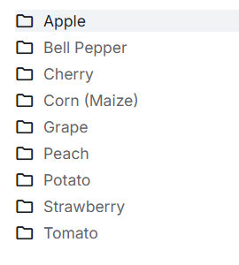
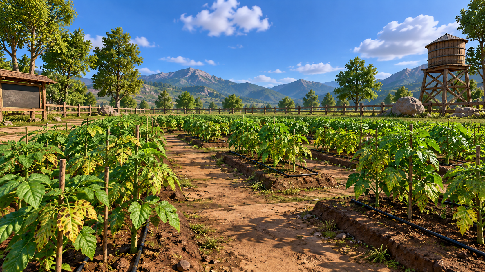
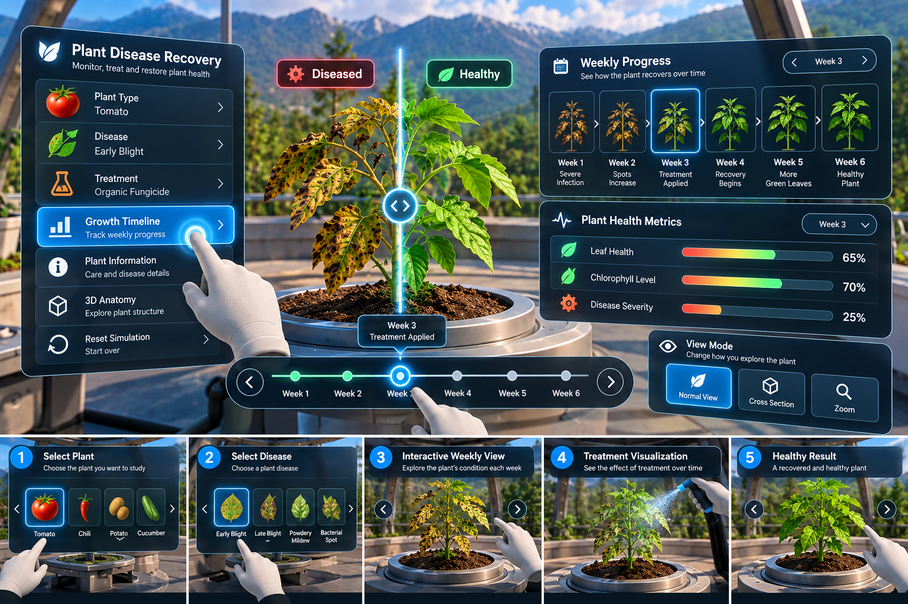

# Master Prompt: BTP Plant Disease VR Experience

This is the implementation specification for the BTP plant disease VR project (Unity 6000.5.5f1, URP). It fixes scope, assets, scene flow, interaction rules, demo data, build targets, and acceptance checks, so a Unity developer can build it without choosing scope or inventing missing assets.

---

## 1. Reference images

| Image | Role |
|---|---|
| `References/plant_types.png` | **Authoritative plant list** (requested species) |
| `References/farming_land.png` | **Visual reference for the Farm** (starting environment) |
| `References/lab.png` | **Visual reference for the Lab** (second environment and interface) |

### Plant list (authoritative)
Apple, Bell Pepper, Cherry, Corn (Maize), Grape, Peach, Potato, Strawberry, Tomato.



### Farm (starting environment)
Recreate its sunny field, raised soil rows, central walking path, timber fence, trees, distant mountains, water tower, notice board, and visible signs of unhealthy foliage.



### Lab (second environment and interface)
Translate its central plant pedestal, diseased/healthy comparison, dark translucent panels, cyan highlights, week timeline, and health metrics into **spatial VR controls**. Chili, Cucumber, the treatment text, and the percentages in this image are **examples only**. They are not extra plant or scientific data requirements.



---

## 2. Build targets

| Target | Profile | Settings |
|---|---|---|
| Meta Quest 2 / Quest 3 (standalone) | Meta Quest build profile (Android) | OpenXR, Vulkan only, IL2CPP, ARM64, Linear color, Single Pass Instanced, min API level required by the Meta Quest build profile |
| Windows PC VR (Link / SteamVR / any OpenXR runtime) | Windows build profile | OpenXR, x86_64, DX11 |

- Quality levels: **Quest2** (baseline: `Mobile_RPAsset`), **Quest3** (higher render scale and texture/LOD budget), **PC** (`PC_RPAsset`).
- **Performance target: stable 72 FPS on Quest 2 in both environments.** Quest 2 is the profiling baseline for foliage density, texture sizes, shadows, draw calls, and memory.

## 3. Packages

`com.unity.xr.management`, `com.unity.xr.openxr`, `com.unity.xr.interaction.toolkit` (3.x, with the Starter Assets and Hands Interaction Demo samples), `com.unity.xr.hands`, `com.unity.cloud.gltfast`. `com.unity.pipeline` is used only as an editor automation tool.

---

## 4. Scene flow

```
XRBootstrap (persistent)  ──loads──▶  Farm (default)
                                       │  "Enter Lab"
                                       ▼
                                      Lab
                                       │  "Return to Farm"
                                       ▼
                                      Farm   (plant selection kept)
```

| Scene | Contents |
|---|---|
| `Assets/Scenes/XRBootstrap.unity` | **First in Build Settings.** The only XR Origin, input action manager, XR input modality manager, EventSystem with XR UI input module, fade overlay, `SelectionState`, `EnvironmentController`. Loads the Farm on start. |
| `Assets/Scenes/Envirornment.unity` | **The Farm** (default environment), loaded additively. Has a `SpawnAnchor`. This is the project's renamed template scene; pressing Play in it loads XRBootstrap automatically. |
| `Assets/Scenes/Lab.unity` | Lab environment and UI, loaded additively. Has a `SpawnAnchor`. |

### State and transitions
- **Plant catalog**: exactly **seven** entries. Each has a stable plant ID, display name, farm prefab, lab prefab, info text, and whether the Tomato recovery demo is available (Tomato only).
- `SelectPlant(plantId)` updates the shared selection, and both scenes' UI respond to the change.
- `SwitchEnvironment(Farm|Lab)`: fade out → unload the old environment → load the target → place the XR Origin at the target's spawn anchor → fade in. Ignore repeated presses while a switch is running.
- Keep **one XR Origin** for the whole session. There must never be duplicate cameras, audio listeners, EventSystems, or input modules.
- If the user enters the Lab without selecting a plant, **Tomato** is selected.
- Returning to the Farm keeps the selection. **Reset** resets only the Tomato demo week.
- A missing model reference shows a **visible setup error** placeholder (in the Editor or development builds). It never silently shows the wrong species.

---

## 5. Asset map

All sources are under `Assets/Plant_Asstes/` (the exact folder name, typo included).

| Plant ID | Display name | Source model | Notes |
|---|---|---|---|
| `apple` | Apple | `Apple_new/Meshy_AI_apple_tree_3d_0923203849_image-to-3d-texture_fbx/` | Very heavy Meshy export (≈356 MB). Decimate. Orchard edge. |
| `bell_pepper` | Bell Pepper | `Bell Pepper/Meshy_AI_Colorful_Bell_Pepper__0923184552_texture_fbx/` | Heavy Meshy export (≈187 MB). Decimate. |
| `cherry` | Cherry | `Cherry/fbx/Cherry1.fbx` | SpeedTree-style export (≈6k triangles). Alpha-clipped leaves use `Cherry1_Opacity.tga`. Orchard edge. |
| `corn` | Corn (Maize) | `maize_corn_plant.glb` | Import through **glTFast**. Tall, so place it where it doesn't block the route. |
| `potato` | Potato | `potato-plants-collection/source/Potato_plants_Collection.fbx` | Collection file. Textures in `potato-plants-collection/textures/`. |
| `strawberry` | Strawberry | `Strawberry_1/Meshy_AI_strawberry_plant_0923200556_texture_fbx/` | Low-growing crop. |
| `tomato` | Tomato | Farm: `Tomato/Meshy_AI_Tomato_Plant_0923194145_texture_fbx/`. Lab: `Tomato_asset/` single-stem model if its geometry is cleaner after optimization | **Only plant with the recovery demo.** |

**Missing assets: Grape and Peach.** No suitable models were supplied. They are **not** in the plant catalog and **never appear** as selectable choices in the Farm or the Lab. Add them only when real models are supplied.

**Environment assets:** Build the Farm and Lab structures from Unity geometry and materials. `sci-fi_lab.glb` (≈468 MB) may only be used as a source for a substantially optimized derivative; the raw model must never be placed in Quest scenes. `circuit-de-spa-francorchamps-2022-layout/`, `bermuda+grass.fbx`, `Meshy_AI_apple_tree_split_*.fbx`, `Apple/`, `Strawberry/`, `Tomato_1/`, and `Tree-Fruit_3d/` are not used.

### Prefab requirements (every plant)
- Correct real-world scale, pivot at ground level, URP materials, correct texture import, alpha clipping where needed, and a selection collider.
- **Lab prefab**: detailed close-up model (roughly 50–80k triangles, ≤ 2048 textures).
- **Farm prefab**: lower-detail LOD version for repeated planting (roughly 5–10k triangles, ≤ 1024 textures, GPU instancing).
- Rough target heights: fruit trees 3–4 m, corn about 2 m, tomato/pepper 0.8–1 m, potato/strawberry 0.3–0.5 m.

---

## 6. Interaction rules

- **Controllers**: ray interaction, teleportation, **30° snap turn**. Smooth movement is **disabled by default**.
- **Quest hands**: hand ray + pinch select, and near **poke** on buttons. Controllers take over automatically whenever hand tracking is lost.
- **PC VR**: controller interaction must be fully functional. Hand controls activate only when the OpenXR runtime supplies hand tracking.
- **Teleport** only onto safe paths and designated viewing points. Never land inside plant beds or scenery.
- **Recenter** control so seated and standing users can realign to the current spawn point.
- **Buttons** give hover, press, and selected feedback. Every control is reachable by controller ray and by hand pinch or poke.
- **Text** is legible at normal headset viewing distance: world-space panels about 1.2–1.5 m away, no face-locked or full-screen UI.
- **Palette**: charcoal translucent panels, white text, cyan (`#22D3EE`) selection states, restrained red/green health cues.

---

## 7. Farm (default scene)

1. A compact, life-sized field with a **central teleportable aisle** and raised soil beds. Low crops are in rows. Apple and Cherry trees stand along an orchard edge, and Corn is where its height won't block the route.
2. Blue sky, warm daylight, distant terrain/mountains, timber fence, notice board, and water tower. The central path and entry controls are visible at spawn.
3. Each of the seven plants has **one labeled, selectable specimen**. Selecting it (controller ray or hand pinch) highlights it, opens a small world-space name card, and saves its plant ID as the current selection.
4. A prominent **Enter Lab** button on the entry notice board, reachable with controller and hand input.

## 8. Lab and VR interface

1. An airy glasshouse/lab: central plant pedestal, mountain or garden backdrop, clean structural frames, cool lighting.
2. The selected plant is displayed on the pedestal. World-space panels are arranged around it within comfortable viewing and reach distance.
3. Panels:
   - **Plant**: switches among the seven available species.
   - **Recovery Demo**: the Tomato demo (section 9).
   - **Plant Information**: concise species identity and an asset-backed 3D view.
4. **Return to Farm** control in a fixed, easy-to-find location.

---

## 9. Tomato recovery demo (illustrative prototype)

> **Label (always visible): "Illustrative prototype. Not diagnostic or treatment advice."**
> This demo shows the interaction and visual progression for Tomato / Early Blight. It does not diagnose plants or recommend treatment.

- **Six-week timeline** with Previous, Next, direct week selection (Weeks 1–6), and **Reset** (back to Week 1).
- **Week 3** is marked **"Demo treatment applied."**
- **Diseased/healthy comparison** around the central pedestal, separated by a cyan visual marker.
- Leaf appearance changes across weeks through a **derived leaf mask** (or leaf-specific material variants). **Fruit, stems, and soil are unaffected.**
- Fixed example metrics (reproducible):

| Week | Leaf health | Chlorophyll | Disease severity |
|---|---:|---:|---:|
| 1 | 25% | 30% | 85% |
| 2 | 40% | 45% | 70% |
| 3 | 65% | 70% | 25% |
| 4 | 75% | 80% | 18% |
| 5 | 88% | 90% | 8% |
| 6 | 96% | 96% | 2% |

- **The six other plants** show their model and information panel. Instead of recovery metrics, they show a clear **"Tomato demo only"** state and a **View Tomato Demo** button. **No disease histories are invented for them.**

---

## 10. Acceptance checks

**Journey**
- [ ] Launch opens the Farm through XRBootstrap.
- [ ] Each of the seven plants can be selected (highlight + name card).
- [ ] Enter Lab shows the selected plant's model on the pedestal (Tomato if nothing was selected).
- [ ] Tomato demo: Previous/Next, direct week jump, and Reset all update the leaves and metrics exactly as in the table. Week 3 shows "Demo treatment applied".
- [ ] A non-tomato plant shows "Tomato demo only", and View Tomato Demo switches to Tomato.
- [ ] Return to Farm keeps the selection.
- [ ] **Grape and Peach never appear** as choices.

**XR**
- [ ] Controller ray, teleport, and 30° snap turn work on Quest 2, Quest 3, and Windows PC VR.
- [ ] Hand ray/pinch and poke work on Quest standalone. Controllers take over when tracking is lost. PC uses controller fallback.
- [ ] Scene transitions fade, with no camera jump and no duplicate XR rig, camera, audio listener, or EventSystem.
- [ ] Teleport never lands inside beds or scenery.

**Build and quality**
- [ ] The Quest (Android) and Windows builds both compile.
- [ ] All models and materials render (no pink materials). Corn imports through glTFast.
- [ ] World-space text is readable in the headset.
- [ ] Stable 72 FPS on Quest 2 in the Farm and the Lab.
